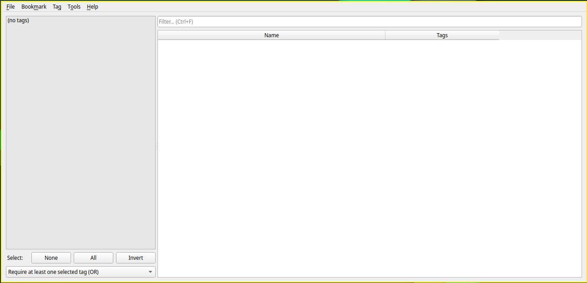
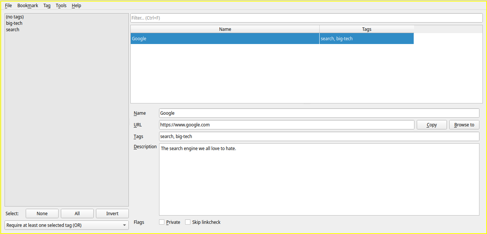
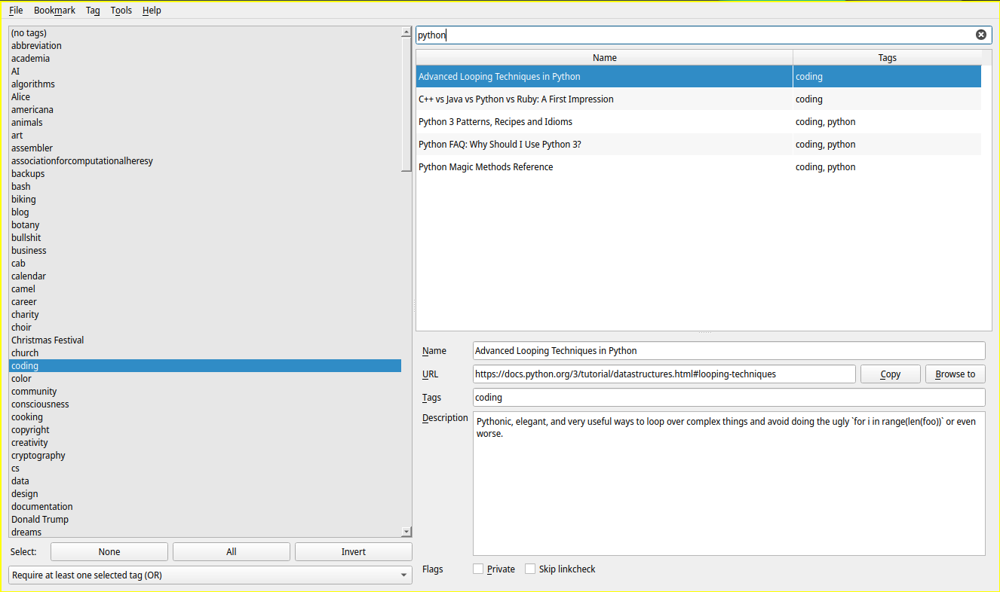
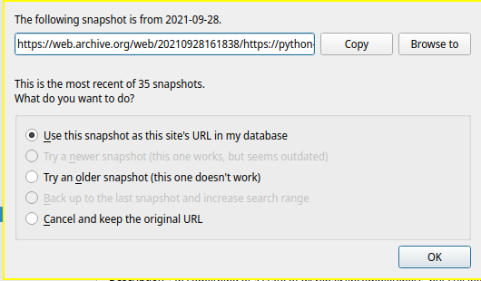
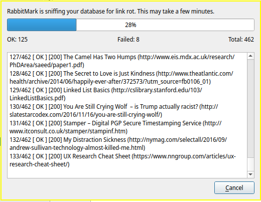
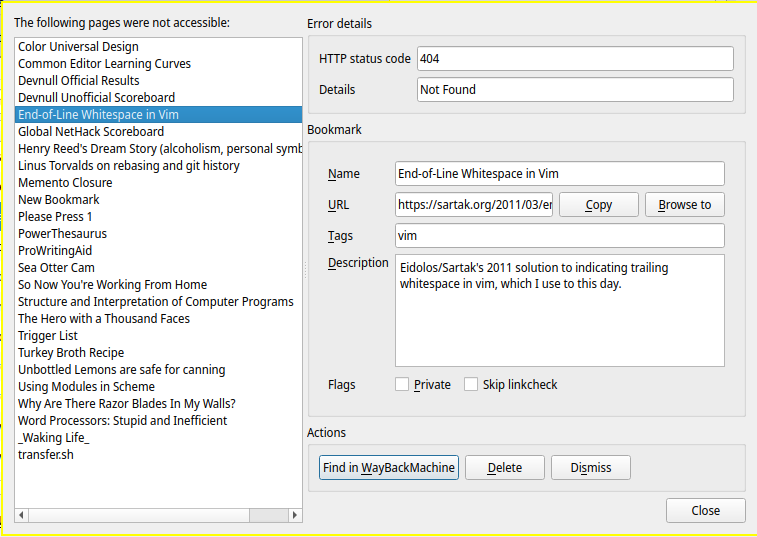

# RabbitMark

**RabbitMark** is a powerful desktop bookmark manager built on the Qt framework,
    designed for efficiently managing large collections of websites.


## Features

* **Tag-based organization**. Folders don't work well for bookmarks; things usually belong in multiple places.
* **Lightning-fast filter and search**.
* **Simple CLI** to search and open items without launching RabbitMark.
* Full-featured **link-checker** to quickly find broken links and correct your bookmarks.
* **Deep integration with the Internet Archive's WayBackMachine**.
  Easily locate snapshots of websites that have gone offline using binary search,
  request an immediate snapshot of a site you want to preserve,
  and replace broken links found by the link checker with snapshots.
* **Private bookmarks**, a simple way to hide some bookmarks when other people are looking at your screen.
* **Browser-independent**: never worry about losing or migrating your bookmarks when you switch browsers again.
* **Open, interchangeable file format**: uses a simple SQLite database and can import and export CSVs.
* **Free and open-source**, GNU GPL3 license.


## Installation

RabbitMark can be installed through pip:

```
pip install rabbitmark
```


## Adding bookmarks

When you launch RabbitMark by typing `rabbitmark`,
    RabbitMark will create a new, empty database for you.



To add your first bookmark, choose **Bookmark > New**.
You'll be prompted to add a name, URL, tags, and description.
Most of these are self-explanatory.
Tags are comma-separated, and each tag you enter will be added to the tag pane on the left.
Here's an example for Google:



In most cases, you'll likely want to add bookmarks by copying a URL to your clipboard,
    then choosing **Bookmark > New from Clipboard**.
This works exactly the same way,
    except that the URL field is pre-filled with the URL on your clipboard

There are two additional checkboxes at the bottom, *Private* and *Skip linkcheck*.

**Private** will make this bookmark invisible
    until you choose **File > Show Private Items**;
    this is an easy way to prevent people casually looking at your screen
    from seeing sensitive bookmarks.
(This setting does not encrypt anything;
 anyone sitting down at your computer while you're not there
 can easily turn on this option and see your private bookmarks.
 If you have *really* sensitive bookmarks, you should find another solution.)
If all bookmarks in a tag are private, the tag won't appear in the list either.

**Skip linkcheck** will tell the link-checker
     not to try to determine if this site is accessible when you run the link check.
See *Finding link rot*, below, for more information.


## Searching your bookmarks

By default, RabbitMark will show all of your bookmarks in the bookmark table pane.
You can limit this to find bookmarks of interest in two ways:
    by selecting one or more tags in the left pane,
    and by typing text into the **Filter** box at the top of the screen.

Once you've found what you're looking for,
    click the **Copy** button next to the URL to copy it to your clipboard,
    or the **Browse to** button to open it in a new tab in your default browser.
You can also use the respective keyboard shortcuts, **Ctrl+Shift+C** and **Ctrl+B**.




### Tags

In most cases, you'll likely select a single tag in the left pane.
This will show only bookmarks that have that exact tag.
For more complicated searches, you can also select multiple tags.
By default, this will find all bookmarks that have at least one of those tags (an OR search),
    but you can change this to find only bookmarks that have both tags
    using the drop-down menu underneath the tags list.


### Filtering

The filter box searches for substrings in the name, the URL, and the description.
This means that usually typing a word or two you expect to be related to the bookmark
    will bring it up.
Note that currently you cannot search for multiple words that aren't adjacent
    (for example, in the screenshot below, typing `Python Ruby` would return no results
     even though there's a bookmark whose title contains both `Python` and `Ruby`,
     since they're separated by the word `vs`).
In practice, I have been using this filtering method for about ten years
    and have never been frustrated by this limitation.


## Managing tags

Once you have a lot of bookmarks, you'll likely find you've ended up
    with duplicate tags, useless tags, and poorly named tags.
You can merge, delete, or rename tags from the **Tags** menu;
    the only trick here is that these options only work with a single tag selected,
    so for instance to merge a tag,
    you select the tag you want to merge,
    then choose the Merge option,
    then type the name of the tag you want to merge it into.


## Working with the WayBackMachine

The Internet Archive's [WayBackMachine](https://archive.org/web/) project
    is an essential tool for any serious web user.
In many cases, a website that has gone permanently offline
    or had its URL structure mangled so that links to it no longer work
    will have been archived in the WayBackMachine at some earlier date,
    and you'll be able to access the page you were looking for there.
RabbitMark includes several features
    to make working with the WayBackMachine more convenient.

### Find in WayBackMachine

If you find that a link in your collection no longer works,
    choose **Bookmark > Find in WayBackMachine** or press **Ctrl+W**
    to search the WayBackMachine for snapshots of the site.
If it has at least one snapshot, you'll see a dialog like this one:



The dialog initially starts with the most recent existing snapshot.
You can test the snapshot using the **Copy** and **Browse to** options
    just as you would in RabbitMark's main screen.
If the snapshot has the content you're looking for,
    choose **Use this snapshot as this site's URL in my database**.
Otherwise, you can **Try an older snapshot** and check again,
    and so on until you find a snapshot that both works
    and is reasonably recent.
The dialog carries out a [binary search][bs] on the available snapshots,
    which is the mathematically fastest way to land
    on the best possible snapshot.

If the link returned a 404 at crawl time
    (that is, when the WayBackMachine initially tried to take a snapshot,
     it couldn't find the page),
you'll be warned at the top of the dialog.
In this case, you ordinarily don't need to test the link at all –
    you can just choose to try an older snapshot
    until that warning goes away,
    and then continue from there.

[bs]: https://www.khanacademy.org/computing/computer-science/algorithms/binary-search/a/binary-search


### Request WayBackMachine Snapshot

Sometimes you might find a really cool but very obscure web page
    and want to save it to your bookmarks.
Since there is a lot of content on the Internet <super>[citation needed]</super>,
    the WayBackMachine isn't able to snapshot everything all the time,
    and there may not be a snapshot of very obscure pages.
In this case, it's smart to choose **Bookmark > Request WayBackMachine Snapshot**;
    this will ask the WayBackMachine to grab and permanently store a new snapshot
    on the fly for you,
    so if the page ever goes offline in the future,
    you'll be able to retrieve a copy with **Find in WayBackMachine**.


## Finding link rot

Over time, some bookmarks in your collection will inevitably stop working,
    due to the [link rot][lr] endemic to the web.
It's often useful to check for this proactively
    and correct links
    or delete permanently inaccessible ones.

To get started, choose **Tools > Find Broken Links** or press **Ctrl+L**.
A dialog like this one will appear,
    and RabbitMark will proceed to ask each website
    if the content is still available:



(Specifically, it sends HTTP HEAD requests for best performance.)

Once it finishes up, you'll see the *Review broken links* dialog:



On the left, you can see and page through all the bookmarks
    that failed the link check for one reason or another.
On the right, information of the current bookmark is shown.
At the top are *Error details*; when available,
    this shows exactly what the website reported was wrong.
If there is no clear report of the problem,
    or the error is an unusual one,
    you may wish to click **Browse to** and see what's wrong for yourself.

To fix the issue, you can either directly edit the *Bookmark* area,
    or choose one of the *Actions* at the bottom.
Choosing **Dismiss** will remove the item from the list on the left,
    but keep the bookmark in your database;
    you can use this to keep track of which bookmarks you've dealt with.

Occasionally a site will wrongly report that it's unavailable
    when accessed via the link checker,
    but work normally when accessed in your browser.
(This is usually because a website trying to avoid spammy robots
 makes collateral damage out of useful automated crawlers like RabbitMark's.)
In this case, the easiest course of action is to turn on the *Skip linkcheck* flag
    and then **Dismiss** the bookmark.
This means that you won't be advised in the future
    if the page is legitimately no longer accessible,
    but this is usually preferable to receiving false reports
    that the site isn't working every time you check your links!

Be aware that the link checker is not infallible.
Sometimes a link may still appear to work from the link-checker's perspective
    (it gets an HTTP 200 from the website,
     meaning the page exists and is functioning normally),
    but not contain the same content it used to.
Most humans would consider that a “broken link,”
    but there's no way for the link checker to know that the content is different
    than it used to be.
Nevertheless, the link checker is extremely helpful
    for keeping large databases in good order.

[lr]: https://en.wikipedia.org/wiki/Link_rot


## Importing and exporting

You can export all your bookmarks to a CSV file
    containing the name, URL, description, and tags of each entry
    by choosing **File > Export CSV**.

You can import bookmarks from a CSV file
    by choosing **File > Import CSV**.
The format is a little more flexible here:
    you'll be asked to map columns in the CSV file
    to at least the *Name* and *URL* fields in RabbitMark;
    you can also choose to map
    a (quoted) column of comma-separated tags or a column of descriptions
    to the appropriate fields in RabbitMark,
    if you have these columns in your CSV file.
RabbitMark will skip importing any bookmarks that have the same URL
    as a bookmark you already have in your collection,
    so it's safe to or import a file that might have some sites you already have bookmarks for,
    or a file that gets added to periodically.

## CLI

RabbitMark offers a simple CLI that you can use to find and browse to bookmarks
    without opening RabbitMark.
Currently you cannot edit the database through the CLI
    (I'd be happy to accept PRs for this:
     I just haven't implemented it because I don't need it).
To learn about the CLI, type `rabbitmark --help`.


## Environment

By default, RabbitMark places its SQLite database
    in a `RabbitMark` folder
    in your computer's AppData (Windows), Library (Mac) or XDG_HOME (Linux) folder.
If you'd like the database to be stored somewhere else,
    or you want to use more than one database,
    you can control the database location
    by setting the `RABBITMARK_DATABASE` environment variable
    to the path to a `.db` file,
    e.g., `/home/soren/my-rabbitmark-database.db`.
RabbitMark will create this file on startup if it doesn't exist
    (but any parent folders need to exist).

RabbitMark has an experimental, undocumented Pocket integration
    that can retrieve read items from Pocket
    or send bookmarks to Pocket for later reading;
    the main issue right now is that the only authentication flows available
    don't work well with desktop applications.
I am hoping this will change in the future
    and make enabling this for everyone feasible;
    the integration is really quite slick,
    except for the fact that it's nearly impossible to set up!
You can enable this integration by setting `RABBITMARK_POCKET_INTEGRATION` to `1`,
    but you will need to read the source code to figure out how it works,
    create your own Pocket app and API keys,
    obtain an OAuth token through some weird hack,
    and manually edit your RabbitMark database to configure it,
    so this is not for the faint of heart.
**I will not provide support on this integration.**
